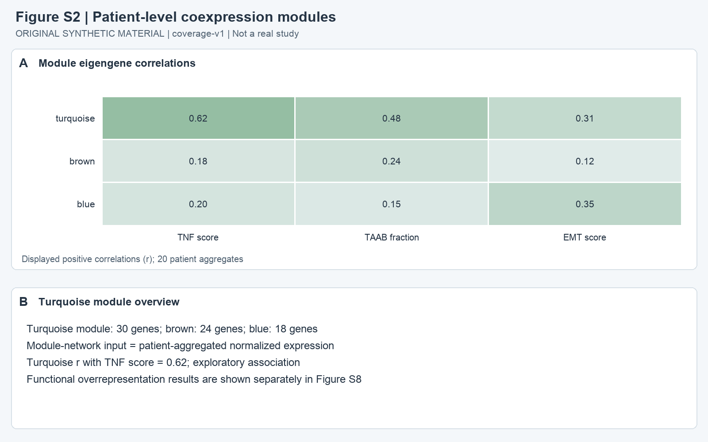
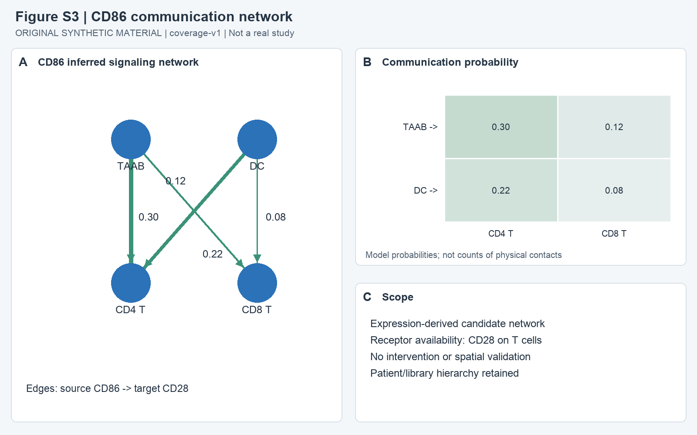
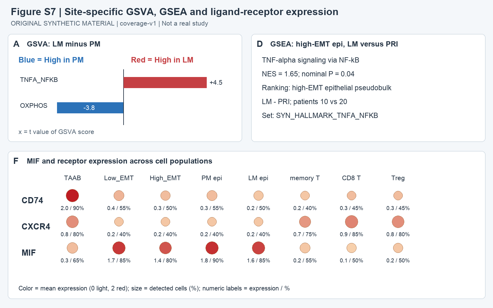

# Supplementary figures

Original synthetic local reading material, coverage-v1. All supplementary source images are present with this document. No raw expression matrix, analysis code or external record is provided.

## s-p1: Figure S1. Quality control and patient integration

A, median detected genes after filtering by tissue site. B, UMAP after library batch correction, displaying cells from all 20 patients P01-P20. C, retained cells and library provenance. A patient may contribute multiple site-specific tissue libraries; batch correction used the library identifier. Mixing is a diagnostic visualization rather than proof of correct biological integration.

## s-p2: Figure S2. Patient-level coexpression modules

A, module eigengene associations with TNF score, TAAB fraction and EMT score across 20 patient aggregates. B, module sizes and network scope. The 30-gene turquoise module has r = 0.62 with the TNF score. Associations are exploratory and do not establish a unique causal pathway.

## s-p3: Figure S3. CD86 communication network

A, CD86-CD28 inferred network; each edge runs from the CD86-expressing source to the CD28-expressing target. B, modeled communication probabilities. C, scope of the inference. TAAB-to-CD4 T probability is 0.30; no spatial or perturbation validation is supplied.

## s-p4: Figure S4. Copy number inference and epithelial identity

A, normalized CNV amplitude for normal and tumor epithelial cells, with B cell reference. B, normal (blue) and tumor (red) embedding by inferred CNV status. C, nine expression-gene clusters C1-C9, totaling 90 genes. The chromosome-block heatmap describes CNV inference and the cluster summary describes gene programs, not cell proportions.

## s-p5: Figure S5. Tissue-site communication differences

A, expression-derived probabilities across PRI, LM and PM. Rows explicitly identify source and target. MIF-CD74-CXCR4 is higher for epithelial-to-TAAB edges than for TAAB-to-epithelial edges. B, tissue labels and inference scope. Communication probability does not measure ligand secretion or prove a necessary mechanism.

## s-p6: Figure S6. B cell developmental potency

C, potency score, from differentiated (0) to totipotent (1). D, relative order, from more differentiated (0) to less differentiated (1). C and D use separate color palettes. F, median potency by phenotype, with TAAB exhibiting lower potential than other B cell phenotypes. The scores are model-derived properties of RNA profiles rather than functional stemness assays.

## s-p7: Figure S7. Site-associated pathways and ligand-receptor expression

A, GSVA t values for LM minus PM; red denotes pathways high in PM and blue denotes pathways high in LM. D, GSEA of the high-EMT epithelial subset for LM versus PRI, NES 1.65 and nominal P 0.04 for the fixed SYN_HALLMARK_TNFA_NFKB gene set. This is a different analysis from Figure 1C, which compares all malignant epithelial LM with PM. F, CD74, CXCR4 and MIF expression across TAAB, low-EMT epithelial, high-EMT epithelial, PM epithelial, LM epithelial, memory T, CD8 T and regulatory T cells. Dot color indicates mean expression and dot size indicates the percentage with detectable expression; labels provide both values.

## s-p8: Figure S8. Turquoise module pathway enrichment

A, KEGG-style overrepresentation in 30 turquoise genes against 1,000 tested expressed background genes, with BH correction across 12 pathways. B, input scope. Enrichment of pathway membership does not directly establish pathway activation in a specific cell population.
