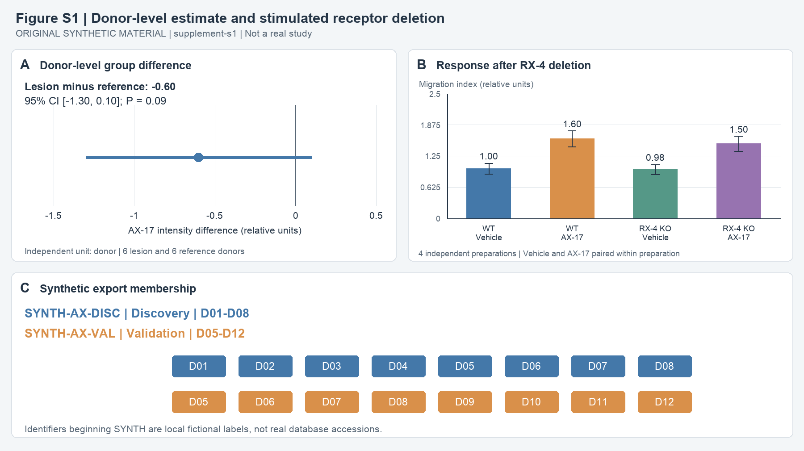

# Companion supplement: AX-17 signalling and tissue migration

**Original synthetic research material — supplement-s1**, companion to main-v1, “AX-17 signalling and tissue migration: an exploratory receptor model”. This file and Figure S1 are original fictional evaluation material under the repository's MIT licence. There is no real DOI or database accession. Logical pages s-p1 and s-p2 are stable locations within this Markdown supplement.

## s-p1 — Supplemental Methods and Figure S1

### Supplemental Methods — Analysis unit

For Figure 1A, 250 cells were first averaged within each section, the two section means were averaged within each tissue, and the two tissue means were averaged within each participant. The primary group comparison used one mean per donor, six donors per group, with a two-sided Welch comparison. Group means are reference 1.80 and lesion 1.20 relative units. The lesion-minus-reference difference is −0.60, 95% CI [−1.30, 0.10], P = 0.09. The study reports these interval and test summaries; raw donor means are not included. Figure S1A displays the reported donor-level estimate.

### Supplemental Methods — Receptor deletion and stimulation

Four independently prepared cultures were tested in each genotype, with vehicle and AX-17 paired within preparation. RX-4 protein abundance in knockout cultures was less than 5% of wild type by the reported assay. These abundance data are not provided as an image or raw table. The migration summaries and paired stimulus contrasts are in Table S1 and Figure S1B. Table S1 reports within-genotype differences; the study did not test equality of the two genotype responses or fit a genotype-by-stimulus interaction. Inh-R selectivity and endogenous CY-2 loss were not assessed in the supplied materials.

**Figure S1. Supplemental estimates and export membership.** (A) Donor-level difference for the tissue comparison in Figure 1A; line shows reported 95% CI. (B) Migration under vehicle and AX-17 in wild-type and RX-4-knockout cultures. Means ± SD, four independent culture preparations per genotype, stimulus paired within preparation. (C) Donor membership in two fictional exported data labels; IDs designate the same donors across exports.

### Table S1 — Migration summaries and paired stimulus contrasts

| Genotype | Vehicle mean ± SD | AX-17 mean ± SD | AX-17 minus vehicle, reported 95% CI | Independent preparations |
|---|---:|---:|---:|---:|
| Wild type | 1.00 ± 0.11 | 1.60 ± 0.16 | 0.60 [0.34, 0.86] | 4, with paired conditions |
| RX-4 knockout | 0.98 ± 0.10 | 1.50 ± 0.15 | 0.52 [0.25, 0.79] | 4, with paired conditions |

The manuscript's schematic places RX-4 between AX-17 and CY-2. Alternative receptors, effects on proliferation or survival, and pharmacological off-target effects were not separated by these assays.

## s-p2 — Synthetic export manifest

### Table S2 — Export labels, sample membership and figure use

| Fictional export | Role assigned in manuscript | Donor IDs actually retained | Materials per retained donor | Analysis supported |
|---|---|---|---|---|
| SYNTH-AX-DISC | Discovery | D01, D02, D03, D04, D05, D06, D07, D08 | 2 tissues × 2 sections × 250 retained cells | Figure 1A tissue screening |
| SYNTH-AX-VAL | Validation | D05, D06, D07, D08, D09, D10, D11, D12 | 2 tissues × 2 sections × 250 retained cells | Tissue-direction check discussed at main p1; not separately plotted |

Donor IDs D01–D06 designate lesion participants; D07–D12 designate reference participants. Repeated IDs denote the same participant and the same sampled tissues and sections, rather than a second sampling occasion. The full Figure 1A tissue summary combines the 12 distinct donors. Figure 1B is a local plasma/culture summary from those 12 participants, not a separate external cohort. Figures 1C–F use SynE1 culture experiments and are not derived from either tissue export. All IDs and exports are synthetic. This membership manifest is supplied locally; expression matrices, donor-level intensity vectors and analysis scripts are not supplied.
