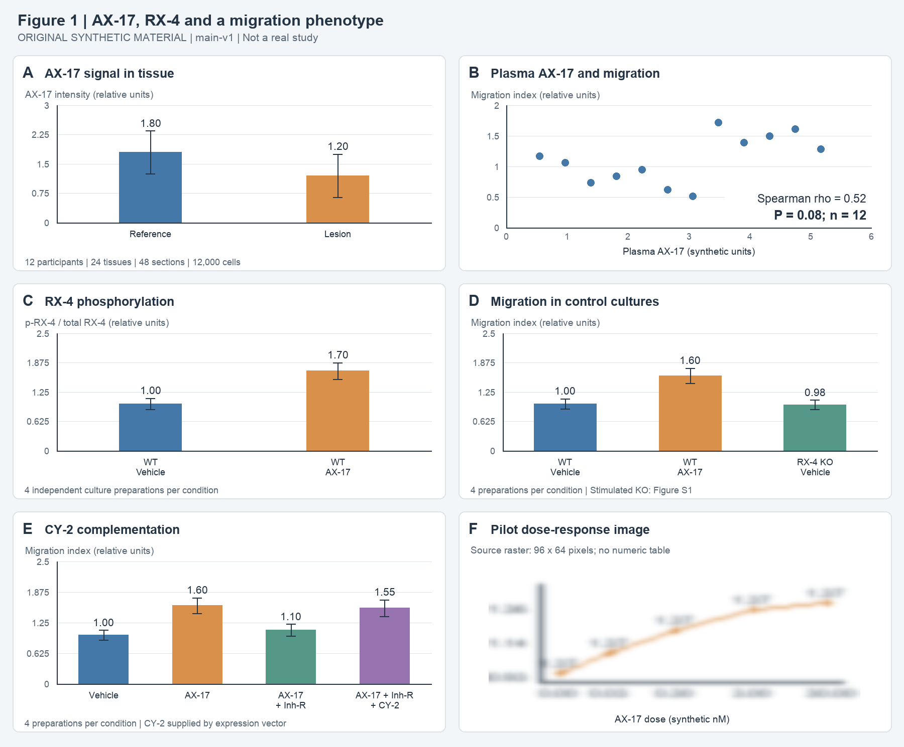

# Figure 1B–D: association, receptor activation and the missing stimulus comparison

Figure 1B–D supplies a participant-level correlation and two culture observations relevant to the proposed AX-17 → RX-4 → CY-2 → migration route. The panels support a candidate relationship and an AX-17 response in SynE1 cultures. They leave **RX-4 dependence of induced migration unresolved** because the stimulated knockout condition is assigned to an unavailable supplement. Figure 1B also has an unresolved P-value discrepancy. All materials are explicitly synthetic and must not be cited as biomedical findings.

M1 = [main.md](input/main.md), **main-v1**, *AX-17 signalling and tissue migration: an exploratory receptor model*. It has no real DOI, journal record or database accession. Citations below use its own logical pages p1–p3 and actual section titles; these are not PDF page numbers. F1 = the supplied [Figure 1](input/figure1.png).

## How the panels connect

The Introduction asks whether AX-17 acts through RX-4 and downstream CY-2 to change migration. B asks whether two participant-associated measurements vary together. C asks whether AX-17 exposure changes a receptor phosphorylation readout. D asks whether wild-type migration responds to AX-17 and whether receptor deletion changes the baseline. Moving from B to C–D changes the experimental system from participants to a single fictional epithelial line; these panels do not directly demonstrate that the culture route explains the participant association. [M1 p1: Introduction; Results — Tissue and plasma observations, plasma paragraph; Results — RX-4 and CY-2 in culture, first paragraph.](input/main.md)

## Panel B: a positive rank association with conflicting statistics

The input is plasma AX-17 and a donor-associated migration index, with **one point per participant, n = 12**. Spearman rho summarises the rank association between these variables; the output is an association estimate, not an intervention effect or a validated prediction model. The image labels the x-axis as plasma AX-17 in synthetic units and the y-axis as migration index in relative units. [M1 p2: complete Fig. 1 legend; F1 B.](input/main.md)

The image and Results agree on **rho = 0.52**, but the Results says **P = 0.8** and the image says **P = 0.08**. This conflict remains unresolved. Neither stated P value is below 0.05; a positive rho alone does not establish a reliable population association. A confidence interval and the test implementation are not provided in the material read for this panel. I did not recover point coordinates or recompute significance. [M1 p1: Results — Tissue and plasma observations, plasma paragraph; F1 B.](input/main.md)

The text calls two public-export labels discovery and validation and interprets replication of direction as independent support. Donor IDs and retained sample lists are said to accompany those labels in the supplement. That supplement is absent from the supplied inputs, so neither cohort independence nor sample overlap can be confirmed. The 12,000 cell measurements mentioned in the complete legend do not increase B's independent sample size beyond its 12 participant points. [M1 p3: Methods — Tissue collection and measurement; p2: complete legend.](input/main.md)

## Panel C: AX-17 changes a phosphorylation readout

The input is wild-type SynE1 cultures treated with AX-17 or vehicle for **24 hours**. The assay yields phosphorylated RX-4 relative to total RX-4, normalised to wild-type vehicle = 1.00. Each condition uses **four independently prepared cultures**; the legend defines the summaries as mean ± SD. [M1 p3: Methods — Culture perturbations; p2: Fig. 1C legend.](input/main.md)

The visible annotations are **1.00 with vehicle and 1.70 with AX-17**. Simple arithmetic gives a difference of **0.70 normalised ratio units**, or 1.70-fold relative to the vehicle mean. This supports a change in the receptor-associated phosphorylation readout under the exposure condition. It does not independently show direct AX-17–RX-4 binding, identify the phosphorylation kinetics, or prove that RX-4 mediates migration. No panel-specific P value, confidence interval or numeric SD is supplied in the material inspected, so the visible mean separation cannot substitute for statistical inference. [M1 p1: culture Results, first paragraph; F1 C; M1 p2–p3.](input/main.md)

## Panel D: a migration response and a baseline knockout control

The migration readout is measured in **wild-type vehicle, wild-type AX-17, and RX-4 knockout vehicle** cultures. Four independent culture preparations are reported per condition, with mean ± SD and wild-type vehicle normalisation. The displayed means are **1.00, 1.60 and 0.98**, respectively. AX-17 therefore increases the wild-type mean by **0.60 relative units**; the knockout vehicle mean differs from wild-type vehicle by **−0.02**. [F1 D; M1 p2: complete legend; p3: Methods — Culture perturbations.](input/main.md)

The knockout vehicle condition is a useful baseline control. Its similar mean does not prove equivalence, and it cannot answer whether the knockout eliminates the induced response. That question requires RX-4 knockout **with AX-17**, compared with its own vehicle baseline and with the wild-type response. The source explicitly assigns that condition and preparation pairing to Figure S1. It also reports that deletion confirmation by protein abundance is in the supplement. These items were not supplied, so their results and adequacy were not checked; they should not be described as experiments the authors failed to perform. [M1 p1: culture Results, first paragraph; p2: Fig. 1D legend; p3: culture Methods.](input/main.md)

## Target evidence record

| ID / claim or concern | Source version and location | Comparison, denominator and statistical unit | Actual check | Boundary or conflict |
|---|---|---|---|---|
| E1: plasma association | M1 p1 plasma Results; p2 legend; F1 B | Plasma AX-17 vs participant migration index; 12 participants; one point each | Read text/legend; checked axes, rho and P annotation | rho = 0.52; P = 0.8 in prose vs 0.08 in image; no recomputed P or causal inference |
| E2: independent validation | M1 p1 plasma Results; p3 tissue Methods | Discovery vs validation export labels; participant identifiers/sample lists unavailable | Read reporting and the statement that IDs are in supplement | Independent participants and overlap unverified; labels alone do not establish independence |
| E3: phosphorylation response | M1 p1 culture Results; p2 legend; p3 culture Methods; F1 C | WT vehicle vs WT AX-17; four independent cultures/condition; mean ± SD | Read methods; checked 1.00 and 1.70; calculated 1.70 − 1.00 = 0.70 and 1.70/1.00 = 1.70 | Exposure-associated readout change in SynE1; no direct binding or migration mediation demonstrated here |
| E4: migration and receptor requirement | M1 p1 culture Results; p2 legend; p3 culture Methods; F1 D | WT vehicle / WT AX-17 / KO vehicle; four cultures/condition; mean ± SD | Checked groups and 1.00 / 1.60 / 0.98; calculated +0.60 and −0.02 | Baseline similarity is not equivalence or loss of induced response; stimulated KO, pairing and deletion confirmation remain unexamined in Figure S1/supplement |

## What would resolve the local mechanism question

Prioritise the reported Figure S1 comparison before claiming receptor necessity. For an adapted experiment, measure vehicle and AX-17 responses in wild-type and RX-4 knockout cultures, retain preparation pairing, and compare the **AX-17-induced change across genotypes**. RX-4 re-expression, verified receptor loss, and viability measurements would help distinguish receptor dependence from genotype-associated changes in culture fitness. These are proposed checks; no such reanalysis or additional experiment was performed here. A further CY-2 claim requires its own evidence beyond B–D.

## Actual reading and resource status

I read the source identity/version statement and Introduction, the plasma Results paragraph, the first culture Results paragraph, the complete Figure 1 legend, and both supplied Methods subsections. I scanned section headings for navigation. I viewed the whole six-panel image for layout and inspected B–D's axes, group labels, numeric annotations and visible variability bars; those details were legible without cropping.

I did not read the tissue Results paragraph, the CY-2 complementation Results paragraph, Discussion or Data and resource statement. A, E and F were visible in the full image and their legends were read, but they were not assessed as additional results in this focused report. No supplement, donor metadata, raw data or code was supplied or read. No external search, download, P-value reconstruction or raw-data reanalysis was performed.

