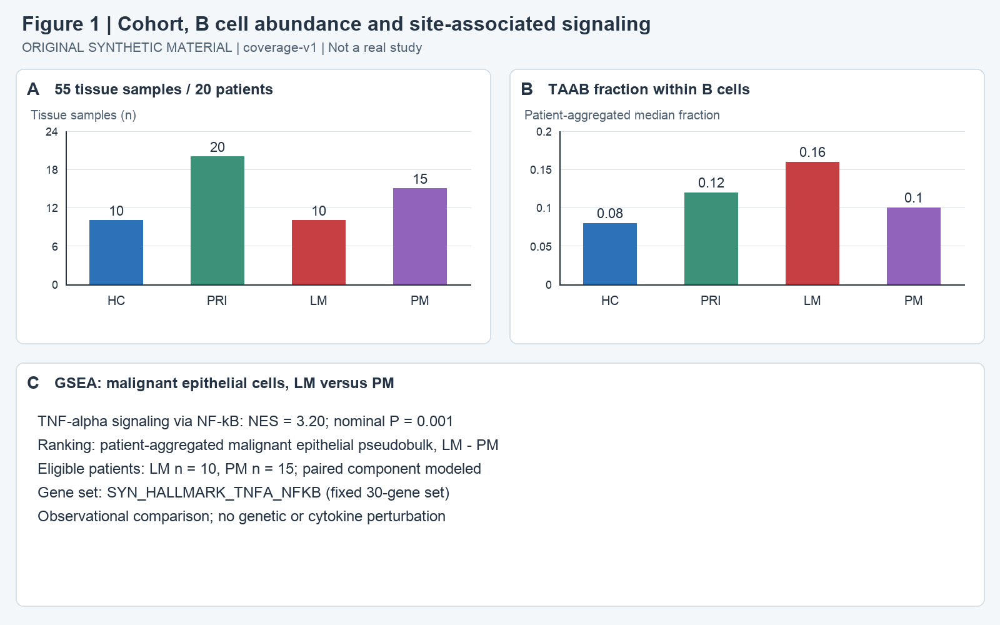
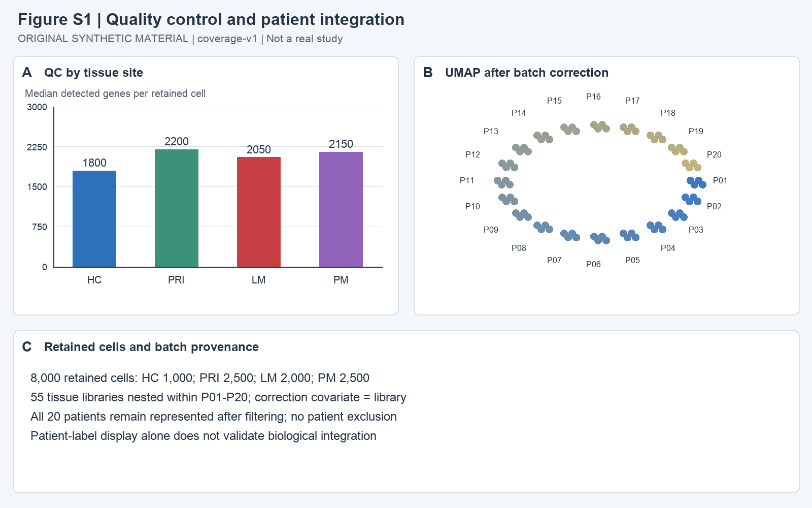
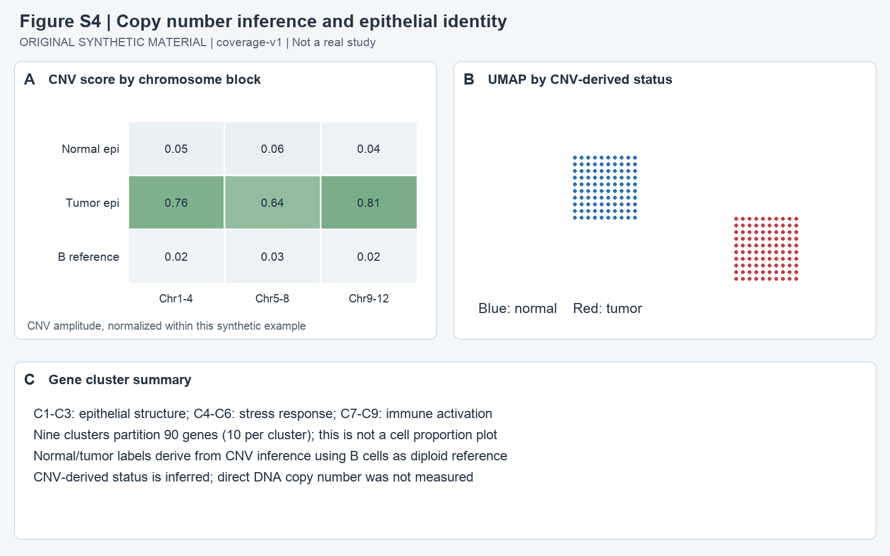
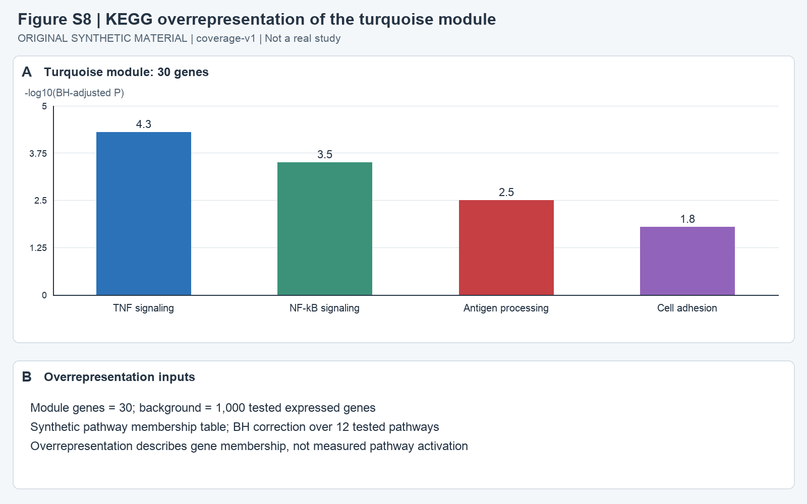
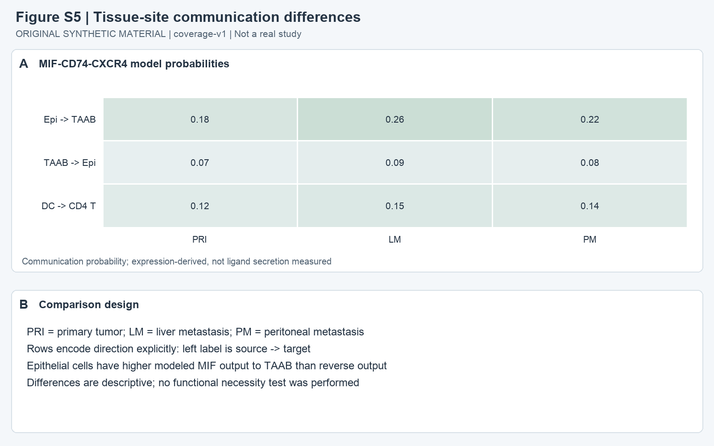
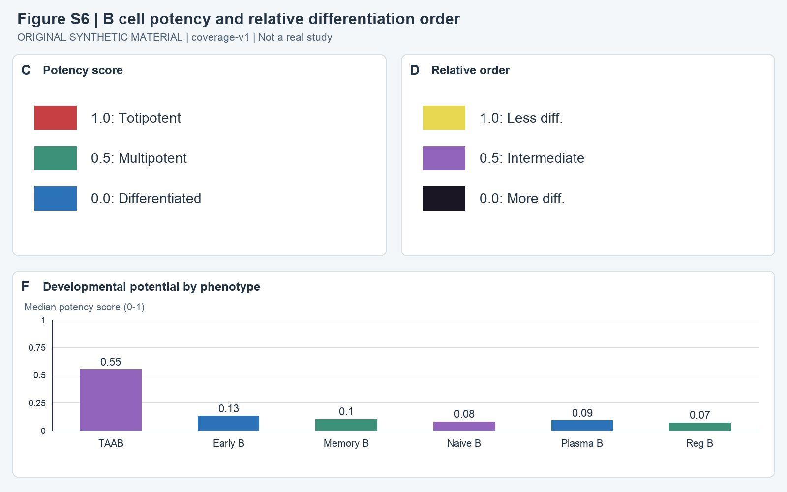

# 胃组织 B 细胞状态与部位相关信号：离线合成材料中文精读

本材料以多部位、患者聚合的 RNA 观察分析描述肿瘤相关非典型 B 细胞（TAAB）与上皮信号的关联：肝转移部位的 TAAB 比例中位数较高，上皮→TAAB 的 MIF–CD74–CXCR4 候选通讯强于反向。证据到达“部位与状态关联、候选作用方向”，尚未到达分泌、功能必要性或因果机制。它是明确标注的虚构合成研究，不能作为真实患者发现引用。

**阅读建议：选择性精读其设计和证据组织。** 最值得借鉴的是患者与组织层级的区分、比较身份的保留，以及模块、富集和通讯证据的联读；潜能结论和 GSVA 图例有 **2 处已确认图文冲突**，在澄清前不宜据它们写生物学结论。本文适合练习多部位单细胞研究的解释与核查。

## 来源与本次范围

| 项目 | 核对结果 |
|---|---|
| 原题 | B cell states and site-associated signaling in gastric tissue |
| 来源与版本 | 用户指定隔离目录中的原创本地合成材料，coverage-v1；虚构观察研究 |
| 期刊、年份、DOI | 已读材料未报告；材料明确无真实 DOI、数据库 accession 或外部记录 |
| M1 | [input/main.md](input/main.md)，全文、方法和 Figure 1 完整图注已读 |
| S1 | [input/supplement.md](input/supplement.md)，全部补图图注及随附方法范围说明已读 |
| I1 | figure1.png 及 figure-s1.png–figure-s8.png；均标注 coverage-v1，来源身份一致 |
| 图像范围 | 1 张主图、8 张补图均已整图概览；9 张图均有明确面板核查记录，具体面板列于下文。S6 实际提供 C/D/F，S7 提供 A/D/F，不推测未提供面板 |
| 完成状态 | 完整精读模式，中文，已完成全部可用材料与范围内必要图像核查；科学冲突保留，不等于阅读步骤未完成 |
| 定位约定 | p1/p2/p3、s-p1–s-p8 是 Markdown 中实际小标题；同时提供文本行号，均不是 PDF 文件页或印刷页 |
| 未执行 | 遵照离线任务未联网，也未核查官方更正或撤稿；未取得原始矩阵、代码或 GSEA 排序表，未复现统计、未重分析原始数据 |

查看日志为本轮真实图像工具返回后即时写入的适配日志，共 11 次成功查看，其中 S6、S7 各另作一次冲突复核。日志不是独立导出的宿主原始日志。记录与校验入口见文末。

## 问题与设计：以患者为单位理解多组织数据

原文没有单列 Introduction 或 Discussion。以下背景是根据摘要、方法和结果重建的研究问题：同一胃癌患者不同组织部位的 B 细胞状态是否不同？这些状态与上皮的炎症信号、配受体表达是否同时变化？RNA 推断的潜能能否补充状态描述？这不是材料已证明的领域历史或首创性判断。

### 样本层级与配对关系

| 患者范围 | 贡献的组织 | 患者数 | 组织数 |
|---|---|---:|---:|
| P01–P10 | HC、PRI、LM、PM | 10 | 40 |
| P11–P15 | PRI、PM | 5 | 10 |
| P16–P20 | PRI | 5 | 5 |
| 合计 | HC 10、PRI 20、LM 10、PM 15 | 20 | 55 |

HC 是这些患者的健康邻近组织，不能把它当独立健康供者队列；PRI 为原发胃肿瘤，LM 为肝转移，PM 为腹膜转移，材料没有卵巢转移组。组织嵌套在患者内，细胞又嵌套在组织文库内。QC 后细胞数为 HC 1,000、PRI 2,500、LM 2,000、PM 2,500，共 8,000；这不会把独立患者数增至 8,000。（M1:p1，行7–11；Fig. 1A；S1:s-p1，Fig. S1C）

简单按明确列出的采样关系复算：10×4 + 5×2 + 5×1 = 55 份组织；LM–PM 有 10 名共同患者和 5 名额外 PM 患者，LM–PRI 有 10 名共同患者和 10 名额外 PRI 患者。这是采样层级的算术核对，不是 GSEA 的重新分析。Fig. 1C 和 S7D 的图内人数是相应部位的可用/列示患者数；目标细胞筛选后的患者覆盖、细胞数和模型自由度仍未给出。

部位比较明确使用患者聚合表达，并用 patient blocking 处理重复组织；共表达分析则每患者一份聚合值，共 20 份。此设计已承认嵌套依赖，不能只因存在多组织或多细胞就断言伪重复。具体模型公式、非完整配对的处理以及患者内各部位的聚合权重未报告，所以尚不能独立确认全部统计实现。（M1:p1，行9–11）

### 实际论证顺序

正文 Results 的路线是：

1. 用 TAAB 比例和上皮 GSEA 描述部位关联（Fig. 1B–C、S7D）。
2. 用配受体表达模型提出 TAAB→CD4 T 的 CD86 候选网络，以及上皮→TAAB 的 MIF 候选方向，再查看受体/配体表达（S3、S5、S7F）。
3. 用 RNA 潜能评分描述 B 细胞状态，并承认横断面排序的因果边界（S6）。

S1 为 QC 与文库整合诊断，S4 为上皮身份的 RNA-CNV 依据；S2 将患者模块与表型关联，S8 为相同 turquoise 模块的通路过度代表分析。它们是支持或限制上述叙事的旁支，并非独立验证队列。下面按设计依赖联读图组，避免把图号顺序误当真实推理顺序。

## Figure 1｜部位关联的起点

**目标与方法。** A 说明组织来源，B 将每患者 TAAB/B 细胞比例聚合后取中位数，C 在全部恶性上皮的患者 pseudobulk 中比较 LM−PM。这样将“免疫组成描述”与“上皮基因集关联”分开，前者不能直接解释后者。

**核查 A/B/C。** A 的横轴为 HC/PRI/LM/PM，纵轴是组织数；计数与采样说明一致。B 的分母明确为 B 细胞，四部位中位数分别是 0.08、0.12、0.16、0.10，LM 最高。图中没有个体点、误差线、置信区间或比例差异检验，不能据柱高称 LM 与各组“显著不同”。这些值也不是全部细胞中的 TAAB 比例。

C 明确显示全部恶性上皮、LM 对 PM、固定 30 基因 SYN_HALLMARK_TNFA_NFKB 集，NES 3.20、nominal P 0.001；列示 LM n=10、PM n=15，并说明配对成分已建模。正 NES 对应该 LM−PM 排序中的正向富集。这支持该基因集的部位关联，未证明 TAAB 导致上皮 NF-κB 激活，也没有遗传或细胞因子干预。GSEA 排序表、leading-edge 基因与置换细则缺失，无法独立复现。

**衔接。** TAAB 组成与上皮信号同时变化提供了探索通讯的理由，但二者尚未通过患者层面的中介分析或扰动连成因果链。（M1:p2行15、p3行25；E1–E3）

## Figure S1 与 S4｜质量和细胞身份如何约束后续结果

### S1：QC 与文库整合是诊断，不是成功证明

核查 A/B/C：A 展示每保留细胞检出基因的中位数，HC/PRI/LM/PM 为 1,800/2,200/2,050/2,150。它说明过滤后摘要质量不同，未展示过滤前分布、线粒体比例、双细胞判定或具体阈值，不能据此确认四部位 QC 完全可比。

B 的 P01–P20 标签均可辨认；可见每患者标记的点沿环排列。它确认全部患者有展示，但不是定量的批次混合或生物结构保留测试。C 进一步说明 55 个组织文库嵌套在 20 名患者中，校正协变量是 **文库标识**，且 QC 后全部 20 名患者保留。患者显示色彩与文库校正层级是两件事。本次不把该示意图评价为“整合已成功”，也不因环状布局宣布算法失败；缺少校正前后、按部位/细胞类型的诊断和参数，整合质量只能有限评估。（M1:p1行9；S1:s-p1行9；E4）

### S4：RNA-CNV 支持工作性上皮标签，基因簇不是细胞比例

核查 A/B/C：A 按 Chr1–4、Chr5–8、Chr9–12 展示归一化 CNV 幅度。肿瘤上皮为 0.76/0.64/0.81，正常上皮为 0.05/0.06/0.04，B 细胞参考为 0.02/0.03/0.02。B 的蓝色标签为 normal、红色为 tumor，两点团分开，是按 CNV 推断状态着色的显示，不能当作第二项独立身份验证。

C 的 C1–C9 将 90 个表达基因分为九簇，每簇 10 基因；C1–C3 对应上皮结构，C4–C6 为应激反应，C7–C9 为免疫激活程序。这里的“簇”指基因程序，不能推成九种细胞的比例。以 B 细胞为二倍体参考是方法假设；无匹配 DNA，CNV 幅度不是直接实测拷贝数，也不能确证谱系起源。这一不确定性会传递给使用“全部恶性上皮”的 GSEA 输入。（M1:p1行9；S1:s-p4行27；E6）

## Figure S2 与 S8｜模块关联和通路成员富集分别回答什么

**输入→处理→输出→用途。** S2 输入每患者聚合的归一化表达，概括共表达模块及其 eigengene，再与 TNF score、TAAB fraction、EMT score 相关；S8 取 turquoise 的 30 个基因，相对 1,000 个被检验的表达背景基因做 KEGG 风格过度代表分析，并对 12 条通路进行 BH 校正。前者问“模块随哪些患者特征变化”，后者问“模块的基因成员偏向哪些功能”。

S2 核查 A/B：热图行是模块，列依次为 TNF/TAAB/EMT。turquoise 的 r 为 0.62/0.48/0.31；blue 与 EMT 的 r=0.35，在所展示模块中高于 turquoise 与 EMT 的相关。B 显示 turquoise/brown/blue 分别为 30/24/18 基因，统计单位为 20 份患者聚合值。turquoise 与 TNF 的相对较高相关使其值得做功能解释，但不能称为唯一因果通路；没有相关置信区间、检验校正或模块构建细则，数值应作探索性描述。

S8 核查 A/B：纵轴是 −log10(BH-adjusted P)，TNF signaling、NF-κB signaling、Antigen processing、Cell adhesion 的柱标为 4.3、3.5、2.5、1.8。柱高表示成员富集的统计证据，不是表达倍数、通路活性或激活细胞比例。显示四条通路不等于只检验四条，B 明确校正范围是 12 条。模块同为“30 基因”也不证明它与 GSEA 的固定 30 基因集具有相同成员；材料未提供基因列表，不能假设两者等同。

**证据边界。** S2/S8 共同使 TNF/NF-κB 成为模块功能解释的候选主题；它们复用同一研究的 RNA 信息，且 S8 没有特定细胞群激活的直接测量。S8 的 BH 校正不能替代 Fig. 1C 或 S7D 的 GSEA 多重检验处理。（M1:p1行9；S1:s-p2行15、s-p8行51；E5）

## Figure S3、S5 与 S7F｜先绑定方向，再联读配体与受体表达

### S3：CD86–CD28 候选边

核查 A/B/C：图中箭头定义为 CD86 表达来源→CD28 表达目标，TAAB、DC 在来源端，CD4 T、CD8 T 在目标端。B 给出 TAAB→CD4 T 0.30、TAAB→CD8 T 0.12、DC→CD4 T 0.22、DC→CD8 T 0.08。所展示边中 TAAB→CD4 T 最高，符合正文描述。

这些是模型通讯概率，0.30 不是 30% 细胞发生接触，也不是抗原特异性 T 细胞反应率。C 明确无空间或干预验证，患者/文库层级有保留，但具体模型如何实现层级、概率是否有误差范围未给出。因此图支持候选方向和相对模型值，未证明 TAAB 实际激活或抑制 CD4 T。（S1:s-p3行21；M1:p2行17；E7）

### S5：MIF–CD74–CXCR4 的模型方向

核查 A/B：列顺序为 PRI、LM、PM，左侧行标签明确来源→目标。上皮→TAAB 的值为 0.18/0.26/0.22；TAAB→上皮为 0.07/0.09/0.08。三个部位均为上皮→TAAB 较高，LM 的前向模型值在该三部位中最高。另显示 DC→CD4 T 的 0.12/0.15/0.14，不能把这一行的发送者误套为 TAAB。

这里是同一配受体体系的表达模型，未测量 MIF 分泌量，也没有阻断受体后的功能终点；值的差异是描述性结果，没有可复现的算法、细胞丰度控制或不确定性估计。它将候选来源收敛到上皮，但功能必要性仍需检验。（S1:s-p5行33；M1:p2行17；E8）

### S7F：表达点图与候选方向相容，但不单独决定方向

S7F 横向依次为 TAAB、低 EMT 上皮、高 EMT 上皮、PM 上皮、LM 上皮、memory T、CD8 T、Treg；纵向为 CD74、CXCR4、MIF。颜色表示平均表达，图例为 0 浅至 2 红；点大小表示可检出表达的细胞百分比，数值标签为“平均表达 / 检出率”。

核查各行与对应列后，CD74 在 TAAB 为 2.0/90%，是所展示群中最高；TAAB 的 CXCR4 为 0.8/80%，但 CD8 T 为 0.9/85%，所以不能把 TAAB 称作所有受体的共同最高群。MIF 在低 EMT/高 EMT/PM/LM 上皮为 1.7/85%、1.4/80%、1.8/90%、1.6/85%，在 TAAB、memory T、CD8 T、Treg 为 0.3/65%、0.2/55%、0.1/50%、0.2/50%。这些百分比的分母是相应群内细胞，具体群细胞数未报告，平均表达的归一化单位亦未明确。

因此，“广泛检出 MIF”与“上皮群的平均表达更高”相容，**不是冲突**。这一表达模式与 S5 上皮→TAAB 的候选方向相容，但通讯方向来自 S5 的配受体模型定义，不能只凭红点反推出发送者。低/高 EMT 与部位上皮标签是否相互重叠未给出，不能默认八列为互斥样本。（S1:s-p7行45；M1:p2行17；E8；原图见下一节 S7）

## Figure S7A/D｜两种通路比较与一处图例冲突

**核查 A。** 图内标题为 LM minus PM，横轴是 GSVA score 的 t value。TNFA_NFKB 是红色正值 +4.5，OXPHOS 是蓝色负值 −3.8；图内文字明确“Blue = High in PM”“Red = High in LM”。按 LM−PM 的比较定义，正负方向与这份图内图例自洽：TNFA_NFKB 指向 LM，OXPHOS 指向 PM。t 值不是通路活性的倍数，也不是 NES。

**已确认冲突 E10。** S1:s-p7行45却写红色表示 PM 高、蓝色表示 LM 高。第二轮图像回读重新核对了比较题目、正负 t 值和图内文字，并再次阅读完整图注，确认同一面板的颜色语义相反。这会把通路部位归属颠倒；不能按图注颜色复述方向。报告保留“图内支持的方向”与“图注相反描述”，不替作者认定哪份原始分析正确。

**核查 D，与 Fig. 1C 比较身份分开。**

| 项目 | Figure 1C | Figure S7D |
|---|---|---|
| 细胞集合 | 全部恶性上皮 | 高 EMT 上皮子集 |
| 排序对比 | LM−PM | LM−PRI |
| 图内患者数 | LM 10、PM 15，配对成分建模 | LM 10、PRI 20 |
| 基因集 | 固定 30 基因 SYN_HALLMARK_TNFA_NFKB | 同一固定基因集 |
| 图内结果 | NES 3.20，nominal P 0.001 | NES 1.65，nominal P 0.04 |

这两组数值**不构成冲突**：细胞子集和对照部位同时改变。不能将 NES 差异解释为“筛出高 EMT 后信号减弱”，也不能作为独立验证，或拿较小 P 值证明更大生物效应。它们各自支持指定排序中的 TNF/NF-κB 关联，GSEA 排序与名义 P 的重现仍受材料限制。（M1:p1行11、p2行15、p3行25；S1:s-p7行45；E3）

S7 已整图概览，A/D/F 均作标签与数值核查；A 另作第二轮冲突复核。

## Figure S6｜潜能轴义一致，TAAB 结果与文字相反

**方法与目的。** 作者用 CytoTRACE-like RNA 评分和相对顺序补充 B 细胞状态描述。该材料没有给出算法版本、参数、各群样本量、得分聚合的患者层级或功能干性实验。

**核查 C/D/F。** C 定义潜能 0=已分化、0.5=多能、1=全能；D 定义相对顺序 0=更多分化、0.5=中间、1=更少分化。高潜能与较少分化的轴义相容，C/D 使用不同颜色不是生物学矛盾。这里实际提供的是评分端点/图例，而非可读的细胞轨迹分支图，不能凭它描述迁移路径或细胞分布。

F 纵轴明确为 0–1 的中位潜能，TAAB 0.55、Early B 0.13、Memory B 0.10、Naive B 0.08、Plasma B 0.09、Reg B 0.07，图内 TAAB 高于其余全部展示表型。

**已确认冲突 E9。** M1:p2行19和 S1:s-p6行39均称 TAAB 潜能更低。第二轮回读先按 F 的表型标签、纵轴和数值重新建立比较，再与 C/D 端点及两侧文字对照，确认不是配色误解、轴反向或不同比较造成的差异。此冲突使“TAAB 潜能更低”的文字结论不获图支持；图内高评分也不能被升级为真实功能干性。无底层得分不能判定作者原拟报告哪一方向。

不论这一方向如何更正，横断面 RNA 排序都不能证明某 B 表型转变为 TAAB，更不能证明肿瘤诱导了该转变；材料明确未作谱系追踪。（M1:p1行9、p2行19；S1:s-p6行39；E9）

## 核心证据记录

M1/S1/I1 的来源版本均为本地 coverage-v1。以下图像动作只核对显示的标签、方向、数值与范围，不表示原始数据重分析。比较的独立患者层级按 M1:p1 定义；各细胞群分母、筛选后有效患者数未逐项给出的地方保留限制。

| 编号／主张、数字或批评 | 来源与位置 | 比较、样本／分母与统计单位 | 本次实际核查 | 支持边界／冲突 |
|---|---|---|---|---|
| E1：55 组织、20 患者、8,000 细胞是不同层级 | M1:p1行7–9；I1 Fig.1A、S1C | 部位组织10/20/10/15；患者20；细胞嵌套文库/患者 | 读采样设计、看两图标签；手算10×4+5×2+5×1 | 数量一致；不能把55组织或8000细胞当独立患者 |
| E2：LM 的 TAAB/B 中位比例较高，四部位0.08/0.12/0.16/0.10 | M1:p2行15；Fig.1B | B细胞为比例分母，患者聚合中位数；部位患者10/20/10/15，各患者B细胞数未知 | 核查B标题、部位順序与柱标 | 描述性；无误差线、区间或差异检验，不能称显著或因果 |
| E3：两项 GSEA 各自正向富集，不是数值冲突 | M1:p1行11、p2行15、p3行25；S1:s-p7行45；Fig.1C、S7D | 全恶性上皮LM−PM，可用10/15患者；高EMT LM−PRI，图示10/20；患者聚合，固定30基因集 | 看两个面板、联读方法/图注，独立文本审核比较身份 | NES3.20/P0.001 vs1.65/P0.04；子集与参照不同，不比较强弱；名义P，未复现 |
| E4：QC后全部患者保留，但图不能证明整合正确 | M1:p1行9；S1:s-p1行9；S1A–C | 8000细胞、55文库、20患者，校正协变量=文库 | 核查QC中位数、P01–P20标签和C层级说明 | 方法明确承认诊断范围；阈值与定量整合指标未报告，不能断言成功或失败 |
| E5：turquoise与TNF相关，模块成员富集TNF/NF-κB | S1:s-p2行15、s-p8行51；S2A–B、S8A–B | 20患者聚合；r0.62（TNF）/0.48（TAAB）/0.31（EMT）；30模块基因/1000背景、12通路BH | 绑定热图行列与数值，读富集纵轴和输入说明 | −log10校正P柱标4.3/3.5/2.5/1.8；相关与成员富集都非因果或特定细胞激活，基因列表缺失 |
| E6：RNA-CNV工作标签与9个基因簇的含义不同 | M1:p1行9；S1:s-p4行27；S4A–C | 正常/肿瘤上皮与B二倍体参考；基因簇9×10=90基因，细胞数未知 | 读三行CNV数值、蓝normal/红tumor、C1–C9说明 | 推断拷贝数状态；无直接DNA；90基因不是细胞比例 |
| E7：CD86候选TAAB→CD4 T边为0.30 | M1:p2行17；S1:s-p3行21；S3A–C | 来源CD86→目标CD28；四边0.30/0.12/0.22/0.08，患者/文库层级保留，具体估计单位未详述 | 核查箭头、来源/目标与热图行列 | 模型概率不是接触比例；未空间/扰动验证，不证明T细胞功能 |
| E8：上皮→TAAB MIF模型较高，MIF广泛但强度不均 | M1:p2行17；S1:s-p5行33、s-p7行45；S5A–B、S7F | PRI/LM/PM前向0.18/0.26/0.22，反向0.07/0.09/0.08；点图百分比以对应群细胞为分母，群n未知 | 绑定方向行、部位列、F基因与群标签，区分颜色/点大小 | CD74在TAAB2.0/90%最高；MIF上皮1.4–1.8/80–90%，其余0.1–0.3/50–65%；广泛检出不是均等表达；不证明分泌或必要性 |
| E9：TAAB潜能更低的文字与F图相反（确认冲突1） | M1:p2行19；S1:s-p6行39；S6C/D/F | 相同中位潜能0–1，六表型；TAAB0.55，其余0.07–0.13；群n和聚合层级未知 | 首次整图核查后第二轮按标签、轴端点、数值重建比较，再读文字两处 | 高潜能轴未反向；图内TAAB最高、文字称更低；无底层得分无法裁定正确结果，RNA评分非功能干性 |
| E10：S7A颜色含义图注与图内相反（确认冲突2） | S1:s-p7行45；S7A | LM−PM的GSVA t值，TNFA_NFKB+4.5、OXPHOS−3.8；具体细胞子集/模型自由度未报告 | 第二轮重新核对比较标题、正负t值、图内红LM/蓝PM与完整图注 | 图内方向自洽；图注红PM/蓝LM相反，可能颠倒部位归属；不混同D的GSEA |
| E11：未形成完整机制链，关键流程不可复现 | M1:p1行3、9–11、p2行17–19；S1行3、各图范围说明 | 单一虚构观察材料，复用同一RNA信息，无独立验证、干预或谱系跟踪 | 通读全部文本与图注，联读相应推断图；文本方法另作独立审核 | 这是已报告设计和材料缺口；不据缺失量化未知偏差，不声称已复现 |

## 研究价值、局限与可迁移设计

可保留的模型是：组织部位、TAAB 组成、患者模块与上皮通路评分存在关联，表达模型提出上皮→TAAB 的 MIF 候选边和 TAAB→CD4 T 的 CD86 候选边。材料没有把“部位→上皮信号→TAAB变化→T细胞功能”逐边用干预测试；共表达、富集、通讯和潜能评分复用 RNA 信息，不能将不同算法输出合计为独立验证。S6 的潜能方向在澄清前应从最终生物学模型中移除。

主要限制按影响范围归纳：

- **会改变表述方向的内部问题：** E9、E10 为已复核的图文冲突；GSEA数值差异、MIF检出范围/强度和C/D配色不计入冲突。
- **部位关联的可迁移性：** 部分配对、患者间差异以及文库/部位关联可能影响比较。患者阻断已有声明，但入排标准、治疗/采样时点、临床协变量、各患者目标细胞覆盖和不完整配对处理未报告；这限制效应解释，不足以认定已存在某种偏差。
- **注释与评分的不确定性：** TAAB marker、高 EMT 阈值、CNV及潜能算法细则、QC门槛缺失；上皮身份、细胞子集和状态排序无法独立复现。
- **机制证据的范围：** 配体/受体RNA、候选通讯、基因集评分是不同测量；没有分泌、空间接触、受体功能或T细胞终点。原始矩阵、GSEA排序表和代码明确未提供；基因集与模块成员列表在已读材料中未报告。

可直接借鉴的是将独立患者、组织文库和细胞数量放在同一设计表中，为每项比较写清参照、细胞子集和统计单位，并联读阴性边界与质量诊断。真正用于研究时，需要重新制定注释、聚合、文库校正和检验细则，保留患者级结果与效应区间，而不是照搬本材料的数字。

以下是本次提出、尚未验证的设计建议：

| 假设／缺口 | 关键对照或验证 | 主要判断指标及证据能力 |
|---|---|---|
| 部位关联超出患者构成差异（E1–E4） | 若有完整配对材料，先在P01–P10式共同患者内比较；与保留非完整配对的患者阻断模型作预设敏感性分析，检查每患者各部位目标细胞覆盖和临床协变量 | 患者级TAAB比例及上皮通路效应、区间与方向稳定性；可加强关联稳健性，仍不单独给出因果 |
| 上皮来源MIF经TAAB受体影响其状态（E8） | 资源允许时做明确来源的上皮–TAAB共培养，分别干预上皮MIF和TAAB的CD74/CXCR4，设载体/同型对照与细胞活性、数量控制；先测分泌MIF、受体蛋白及下游响应。需要时以外源MIF回补上皮MIF损失，且比较受体完整/受损条件 | TAAB预定义状态、下游信号与存活；来源端与受体端分别测试，回补结合受体依赖更能区分一般毒性和该候选边。回补单独不能证明受体必要性 |
| TAAB–CD4 T 的CD86候选边具有功能（E7） | 在可比抗原与活性条件下共培养，并阻断来源CD86或目标CD28；比较DC来源对照与单细胞培养 | T细胞增殖/活化及预定义功能终点；测试该边的作用，不将模型概率直接当功能强度 |
| TAAB潜能方向可以澄清（E9） | 首先取得原始得分、表型标签和聚合规则，核对图/文字对应；之后才考虑独立状态测量。若问题是谱系转换，需时间跟踪或合适的谱系证据 | 标签与得分方向一致性；RNA评分的重复测量只能确认评分，功能干性或谱系因果需要相应独立终点 |

若只能获得 RNA 数据，可先完成患者级敏感性分析和评分/注释稳定性核查，候选通讯保留为假说；它不能替代功能验证。材料本身不支持估算样本量或宣称这些方案已被验证。

## 阅读、引用与资源状态

优先回看 Fig. 1 与 S1 的样本层级、S5/S7F 的方向与表达定义，以及 S2/S8 对相关和成员富集的区分。S6F 和 S7A 应连同冲突位置阅读。真实课题的背景引用须另找真实原始研究；本文数字仅可明确注明为 coverage-v1 合成演示结果，不用作真实患者疗效、机制或领域事实证据。

| 资源 | 本次状态与复现限制 |
|---|---|
| 正文、补充文本 | 本地全文与完整图注已读；没有其他补充发布 |
| 9张来源图 | 全部实际查看；报告使用的 assets 为原文件复制，没有生成式重绘或数据修改；复制不计查看动作 |
| 原始计数、表达矩阵、详细患者元数据 | 原始计数/矩阵明确未提供；仅给患者与组织关系，详细临床信息未报告；未下载、未重分析 |
| 代码与可执行科学分析 | 材料明确未提供，不能称全流程开源或结果已复现 |
| GSEA排序表与基因列表 | 排序表明确缺失；30基因集与模块的具体成员未提供，无法独立重跑或判断重叠 |
| DOI、accession、外部记录 | 无对应真实条目，且本轮按任务未联网 |
| 阅读记录与事件 | [reading-record.json](reading-record.json)、[image-events.jsonl](image-events.jsonl)，覆盖和工具事件逐图对应 |
| 校验输出 | [validation.json](validation.json)，只验证记录、声明和所供事件的一致性；不裁定科学含义，也不认证宿主适配日志 |

已实际运行技能记录校验器并提供本轮事件文件，结果为 pass：主图概览 1/1、补图概览 8/8，9 张图均有面板记录，无 pending、caption_only 或 unreadable 项，错误和警告均为 0。该结果确认声明与所供记录相容；两处科学图文冲突已保留，不由校验器裁决。
